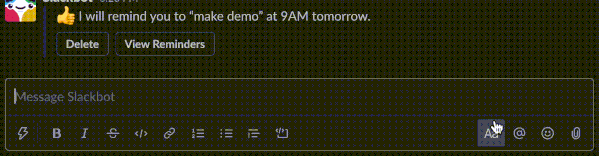

# SLACKCHACK
Slack Slash Command to provide hilarious Chuck Norris jokes!

Made for fun, to learn GO, practice GCP and Terraform.

<!-- START doctoc generated TOC please keep comment here to allow auto update -->
<!-- DON'T EDIT THIS SECTION, INSTEAD RE-RUN doctoc TO UPDATE -->
**Table of Contents**  *generated with [DocToc](https://github.com/thlorenz/doctoc)*

- [SLACKCHACK](#slackchack)

<!-- END doctoc generated TOC please keep comment here to allow auto update -->

